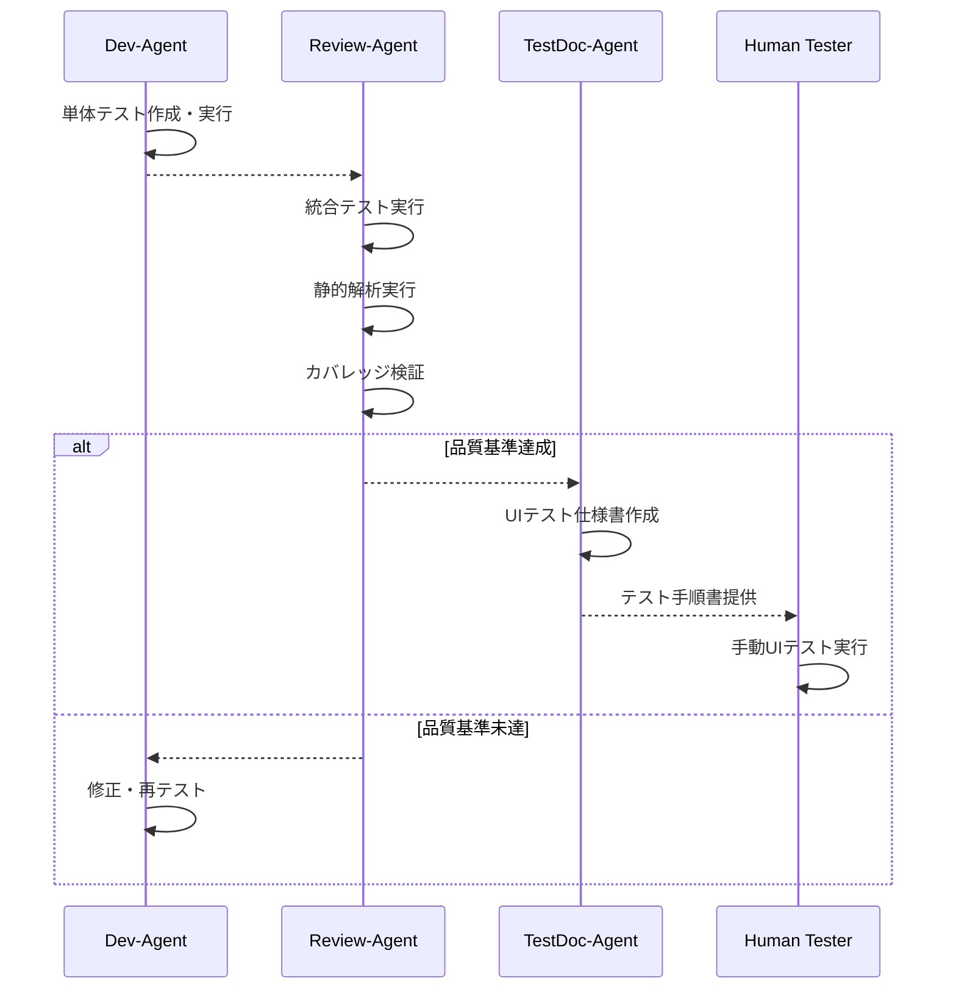

# テスト実行の役割分担

## 概要
複数のエージェントがテスト関連の作業を行うため、役割分担を明確化し重複を防ぐ。

## エージェント別テスト責任

### Dev-Agent
**責任範囲**: 開発中の基本テスト実行
- **単体テスト作成**: 新規実装コードに対して2-4個のアサーションを含むテスト作成
- **単体テスト実行**: 開発中のコードが期待通り動作することの確認
- **基本動作確認**: 実装した機能の基本的な動作検証
- **テストログ出力**: `test.log`ファイルに結果記録

**実行タイミング**: コード実装完了後、コミット前

**品質基準**:
- 全単体テスト通過必須
- 新規コードの基本カバレッジ確保
- ビルドエラーなし

### Review-Agent  
**責任範囲**: 統合品質検証
- **統合テスト実行**: 複数コンポーネント間の連携確認
- **静的解析実行**: StyleCop, Roslyn Analyzers等による品質チェック
- **カバレッジ検証**: 全体カバレッジ80%以上または+5%改善の確認
- **パフォーマンステスト**: 基本的な性能回帰検証

**実行タイミング**: Dev-Agentの`##DEV_DONE##`シグナル後

**品質基準**:
- 全統合テスト通過
- 静的解析警告ゼロ
- カバレッジ基準達成
- パフォーマンス基準内

### TestDoc-Agent
**責任範囲**: UIテスト仕様書作成（実行は対象外）
- **UIテスト項目生成**: ユーザー操作シナリオの文書化
- **テストケース定義**: エッジケース・エラーケースの定義
- **受け入れテスト仕様**: ユーザー視点での検証項目定義
- **テスト環境情報**: ブランチ情報・前提条件の文書化

**実行タイミング**: Review-Agentの`##REVIEW_PASS##`シグナル後

**成果物**: テスト仕様書（実行は人間が行う）

## テスト実行の流れ



## テストファイル管理

### ディレクトリ構成
```
/tests/
├── unit/              # Dev-Agent作成の単体テスト
├── integration/       # Review-Agent実行の統合テスト  
└── ui-specs/         # TestDoc-Agent作成のUI仕様書
```

### ファイル命名規則
- **単体テスト**: `<ClassName>Tests.cs`
- **統合テスト**: `<Feature>IntegrationTests.cs`  
- **UI仕様書**: `<TaskID>_UITestSpec.md`

## 品質ゲートと基準

### Dev-Agent品質ゲート
- [ ] ビルド成功
- [ ] 新規単体テスト全通過
- [ ] 既存テスト非回帰

### Review-Agent品質ゲート  
- [ ] 全統合テスト通過
- [ ] 静的解析警告ゼロ
- [ ] カバレッジ80%以上
- [ ] パフォーマンス基準内

### TestDoc-Agent成果物基準
- [ ] 全UI操作パターン網羅
- [ ] エラーケース定義済み
- [ ] 受け入れ条件明記
- [ ] 実行手順具体化

## エラー時の責任範囲

### Dev-Agent段階での失敗
- **単体テスト失敗**: Dev-Agent内で修正（30分以内）
- **修正不可**: BugFix-Agentに分析依頼

### Review-Agent段階での失敗  
- **統合テスト失敗**: BugFix-Agentによる根本原因分析
- **カバレッジ不足**: Dev-Agentに追加テスト依頼
- **静的解析違反**: 具体的修正箇所をDev-Agentに指示

### TestDoc-Agent段階
- **仕様書不備**: Review-Agentからの再指示で修正
- **実行不可能な手順**: Dev-Agentに実装確認依頼

## 自動化レベル

| テストタイプ | 自動化レベル | 実行者 | トリガー |
|-------------|-------------|--------|----------|
| 単体テスト | 完全自動化 | Dev-Agent | コード変更時 |
| 統合テスト | 完全自動化 | Review-Agent | PR作成時 |
| 静的解析 | 完全自動化 | Review-Agent | PR作成時 |
| UIテスト | 手動実行 | Human | 仕様書完成時 |
| パフォーマンステスト | 半自動化 | Review-Agent | 主要機能変更時 |