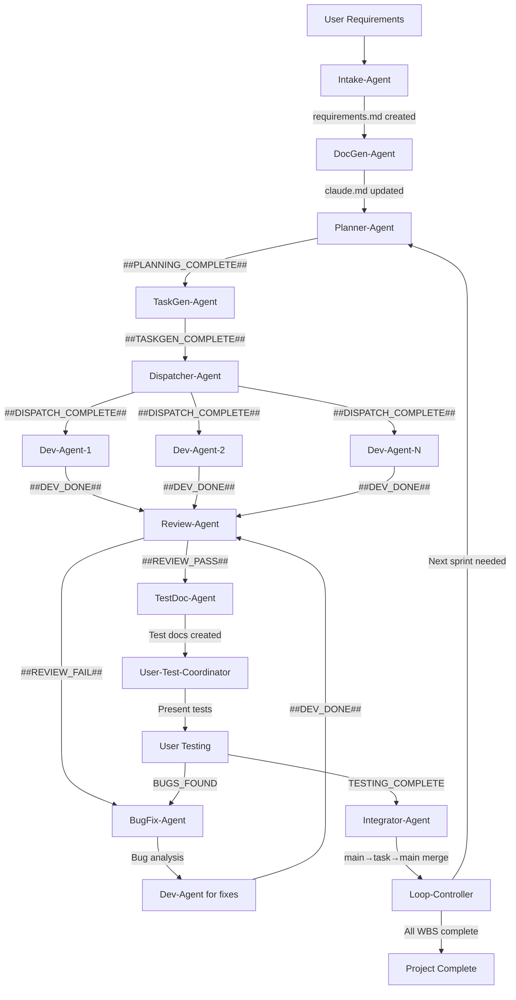
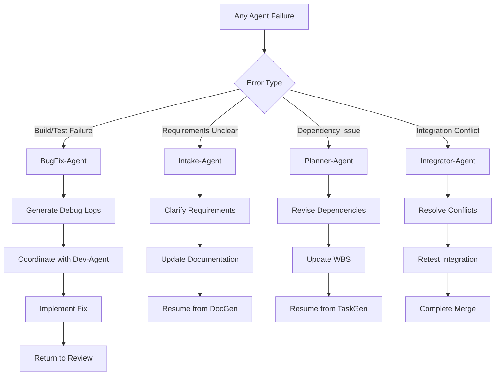

# エージェントワークフロー図

## 全体的なワークフロー

## エージェント間の連携シグナル

### 成功シグナル
- `##PLANNING_COMPLETE##` → Planner-Agent → TaskGen-Agent
- `##TASKGEN_COMPLETE##` → TaskGen-Agent → Dispatcher-Agent  
- `##DISPATCH_COMPLETE##` → Dispatcher-Agent → Dev-Agent(s)
- `##DEV_DONE##` → Dev-Agent → Review-Agent
- `##REVIEW_PASS##` → Review-Agent → TestDoc-Agent
- `##REVIEW_FAIL##` → Review-Agent → BugFix-Agent

### 失敗・エラーシグナル
- `##DEV_FAILED##` → Dev-Agent → BugFix-Agent
- `##REVIEW_FAIL##` → Review-Agent → BugFix-Agent

## 各段階での成果物と前提条件

| エージェント | 前提条件 | 成果物 | 次工程への引き継ぎ |
|-------------|----------|-------|------------------|
| Intake-Agent | User requirements | `docs/requirements.md` `docs/technical_requirements.md` | 要件文書の存在 |
| DocGen-Agent | Requirements files | `claude.md` Directory structure | プロジェクト構造の確立 |
| Planner-Agent | Requirements + claude.md | `docs/pm/wbs.csv` `docs/pm/graph.mmd` `docs/pm/sprint-*.md` | WBS と依存関係の定義 |
| TaskGen-Agent | WBS exists | `docs/pm/tasks/T-*.md` | 詳細タスク仕様 |
| Dispatcher-Agent | Sprint plan + Task files | Git worktrees Updated sprint status | 作業環境の準備 |
| Dev-Agent | Worktree + Task spec | Implemented code Unit tests `test.log` | 動作するコード |
| Review-Agent | Dev completion | Code review `docs/reviews/<TaskID>.md` Coverage report | 品質承認 |
| TestDoc-Agent | Review pass | UI test specifications Test branch info | テスト手順書 |
| BugFix-Agent | Failure signals | Bug analysis Debug logs Fix recommendations | 問題解決指針 |
| Integrator-Agent | User test approval | Merged main branch Clean integration | 本番準備完了 |
| Loop-Controller | Integration complete | Next cycle planning | 継続的開発 |

## エラーハンドリングフロー

## 手動介入が必要な場合

### 自動解決不可能なケース
1. **要件の根本的変更**: Intake-Agent → 手動レビュー必要
2. **アーキテクチャ変更**: DocGen-Agent → 手動設計判断必要  
3. **複雑な依存関係競合**: Planner-Agent → 手動依存関係整理必要
4. **統合時の重大競合**: Integrator-Agent → 手動マージ判断必要

### 通知方法
- エラーログに `[MANUAL_INTERVENTION_REQUIRED]` タグ付与
- 具体的な問題内容と推奨アクション提示
- 関連ファイルパスと修正箇所の明示

## 品質ゲート

各段階で満たすべき条件：

### Dev-Agent完了時
- [ ] ビルド成功
- [ ] 全単体テスト通過  
- [ ] 最低限のカバレッジ達成

### Review-Agent承認時
- [ ] 静的解析クリア
- [ ] 統合テスト通過
- [ ] カバレッジ80%以上達成

### Integrator-Agent実行時
- [ ] マージ競合なし
- [ ] 全テスト通過
- [ ] ビルド成功